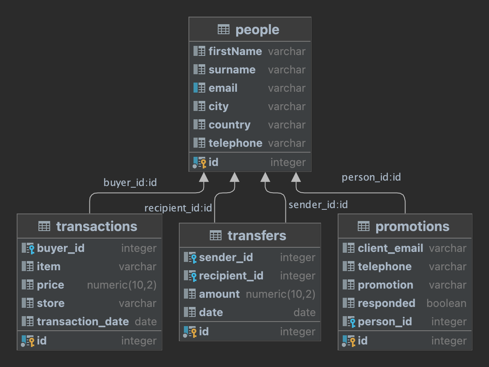
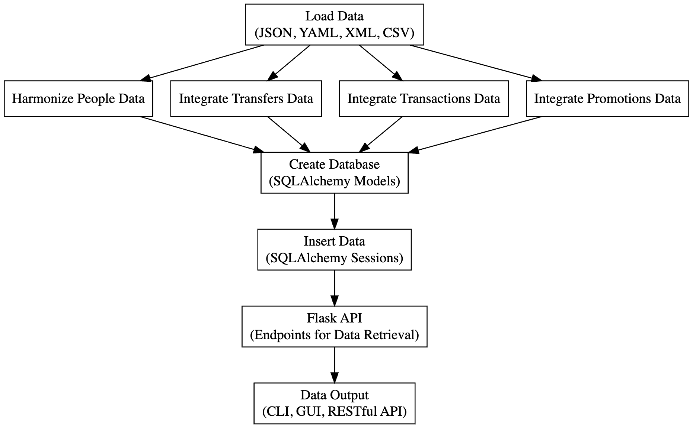

# Venmito Data Engineering Project
## Introduction

This project for Venmito involves developing a solution to manage and analyze data from various sources. The goal is to organize disparate data files into a unified format, providing insights about clients, transactions, transfers, and promotions.
For now this does the following:
- Create a Database and all dataset relations with all of the tables it creates.
- Effectively this connects the data together, and a use case for this is:
  * Missing values in promotions get recovered using the people dataset
  * both people are harmonized together 
  * This can be used to apply data analysis since you can determine:
    * Who has a promotion with more certainty just by the email or phone number
    * Know who is in other datasets that aren't in the People dataset.
    * Can apply descriptive statistics to these datasets.
### Features:
* Creates a Dataset in postgresql.
* Uses docker to basically eliminate all dependency issues and makes it cross platform.
* Plug n Play running (just run docker-compose build and run)
* Entity Relationships improves the data by allowing a better way for filling in holes that are in other tables.
* Can export to .csv, .xlsx, and outputs the first 5 rows into the CLI
* RESTful API with endpoints. Can access this data by connecting to the Database.
* NOTE: There is no GUI for this application, it is not meant to be pretty, it is meant to be useful for production and deployment. 
* TODO: Use a GUI framework to easily interact with the dataset, such as Streamlit.

## Technologies Used 
- **Python** : Main programming language for the project. 
- **Flask** : Used to create a web API for serving processed data. 
- **SQLAlchemy** : ORM (Object Relational Mapper) for handling database interactions. 
- **PostgreSQL** : Database system for storing and retrieving data. 
- **Docker** : Containerization platform to ensure consistent setup across environments. 
- **Pytest** : Testing framework for Python. 
- **Pandas** : Data manipulation and analysis library. 
- **Python-Dotenv** : Library to load environment variables from a `.env` file.
- **Datagrips or PGAdmin4** : Database management tools 

## Project Process Pipeline Diagrams

- This is the Database ER Diagram, this was generated using Datagrips (can be done with PGAdmin4)


- This is a High-Level overview of the project pipeline. 
1. Loads Data
2. Harmonizes and Integrates the Data 
3. Creates Database (SQLAlchemy)
4. Inserts Data 
5. Creates Endpoints

## Project Structure


```bash
venmito_project/
├── config/                   # Configuration files and scripts
├── src/                      # Source code for the Flask application
│ ├── database/
│ │ ├── **init** .py
│ │ ├── create_database.py
│ │ ├── insert_data.py
│ │ └── models.py
│ │
│ ├── load_data/
│ │ ├── **init** .py
│ │ ├── load_csv.py
│ │ ├── load_json.py
│ │ ├── load_xml.py
│ │ └── load_yaml.py
│ │
│ └── utils/
│ ├── **init** .py
│ └── app.py
├── utils/                    # Utility scripts including data processing
├── output/                   # Meant to hold output files like tables and datasets
├── database/                 # Database models and data insertion scripts
├── tests/                    # Test scripts
├── data/                     # Sample data files (JSON, YAML, CSV, XML)
├── .env                      # Environment variables
├── .gitignore                # Specifies untracked files to ignore
├── Dockerfile                # Docker configuration file
├── docker-compose.yml        # Docker compose configuration
├── requirements.txt          # Python dependencies
└── README.md                 # Project documentation
```


## Setup and Installation 
### READ: Before you start:
* **READ: IT IS BEST IF YOU USE DOCKER-COMPOSE UP INSTEAD OF THIS**
* **The .env is necessary for Database credentials, it wont be included in the repo for Security reasons**
1. **Clone the Repository:** 

```bash
git clone https://github.com/xtillion/venmito-JuanGonzalezLopez.git
cd venmito-JuanGonzalezLopez
``` 
2. **Environment Setup:** 
- Install Python 3.10 and Docker. 
- Create a virtual environment and activate it:

```bash
python -m venv venv
source venv/bin/activate  # On Windows, use `venv\Scripts\activate`
``` 
- Install the required Python packages:

```bash
pip install -r requirements.txt
``` 
3. **Environment Variables:**  
- Copy the `.env.example` file to a new file named `.env`. 
- Update the `.env` file with the appropriate values.
- for the purpose of this project the credentials inside the .env are:
```
# .env file
POSTGRES_DB=venmito
POSTGRES_USER=xtillion
POSTGRES_PASSWORD=password
POSTGRES_HOST=db
POSTGRES_PORT=5432
```

### **Docker Setup:** 
- This project has been developed with Docker-compose in mind from the start.
- It uses PostgreSQL through Docker, and **you must create a .env file** in order to run this.
- Ensure Docker is running on your machine. 
- Build the Docker containers:

```bash
docker-compose build
``` 
- Start the Docker containers:

```bash
docker-compose up
```
- Note: add -d at the end if you want to run detached mode.
- You can access the terminal through Docker Desktop or through CLI.
- Warning: if it stays waiting for the app to run just re-run docker, only happens the first time running sometimes.

## Running the Application 
### Note: This is if you are not running through Docker. 
### It is highly recommended to run this in docker to minimize issue.
1. **Database Initialization:**  
- Before the first run, initialize the database:

```bash
python database/create_database.py
``` 
2. **Data Ingestion and Processing:**  
- Run the data ingestion and processing script:

```bash
python database/insert_data.py
``` 
3. **Starting the Flask Application:**  
- The Flask application can be started with Docker using `docker-compose up` or manually:

```bash
python src/app.py
```

## Output (what it looks like in the database - sample)
Using Datagrips (can use PGAdmin4 too) I extracted output tables, and here are a few rows for each dataset table:


### People
| id | firstName | surname   | email                     | city           | country       | telephone |
|----|-----------|-----------|---------------------------|----------------|---------------|-----------|
| 1  | Tim       | Arnold    | tim.arnold@example.com    | Dallas         | United States | 555-4147  |
| 4  | Jane      | Springer  | jane.springer@example.com | Khartoum       | Sudan         | 555-9575  |
| 6  | Michael   | McGrath   | michael.mcgrath@example.com | Rio de Janeiro | Brazil       | 555-8448  |
| 8  | Leah      | Piper     | leah.piper@example.com    | Harbin         | China         | 555-8366  |
| 9  | Julia     | Murray    | julia.murray@example.com  | Fukuoka        | Japan         | 555-3555  |

### Transaction
| id | buyer_id | item      | price | store                      | transaction_date |
|----|----------|-----------|-------|----------------------------|------------------|
| 1  | 83       | banana    | 2.00  | Frolicking Fox Furnishings | 2021-02-22       |
| 2  | 65       | apple     | 3.75  | Whimsical Willow Wares     | 2021-03-07       |
| 3  | 28       | pineapple | 3.50  | Frolicking Fox Furnishings | 2021-03-18       |
| 4  | 77       | mango     | 3.00  | Whimsical Willow Wares     | 2021-06-06       |
| 5  | 77       | mango     | 3.00  | Whimsical Willow Wares     | 2021-06-06       |

### Transfer
| id | sender_id | recipient_id | amount | date       |
|----|-----------|--------------|--------|------------|
| 1  | 41        | 30           | 100.00 | 2021-03-14 |
| 2  | 58        | 66           | 65.00  | 2021-05-27 |
| 3  | 98        | 12           | 90.00  | 2021-08-12 |
| 4  | 98        | 12           | 90.00  | 2021-08-12 |
| 5  | 95        | 61           | 15.00  | 2021-09-08 |

### Promotiion
| id | client_email             | telephone | promotion | responded | person_id |
|----|--------------------------|-----------|-----------|-----------|-----------|
| 1  | stephen.brown@example.com|           | pear      | false     | 86        |
| 2  | dorothy.peake@example.com| 555-8309  | kiwi      | false     | 62        |
| 3  |                          | 555-7998  | mango     | false     | 70        |
| 4  | katherine.butler@example.com | 555-2311 | banana  | true      | 65        |
| 5  | adam.wilson@example.com  | 555-3416  | orange    | true      | 66        |

## Testing

Run the tests using pytest:


```bash
pytest tests/
```
* Note only boiler plate tests were made

## Endpoints

The Flask application provides the following endpoints: 
- `/people`: Retrieves people data. 
- `/transfers`: Retrieves transfer data. 
- `/transactions`: Retrieves transaction data. 
- `/promotions`: Retrieves promotions data. 
- `/health`: Health check endpoint.
## Monitoring and Logging
- The application logs important events and errors, which are crucial for monitoring its health and performance.

## Contributions

Contributions to this project are welcome. Please follow the standard Git workflow - fork, branch, commit, and submit a pull request.